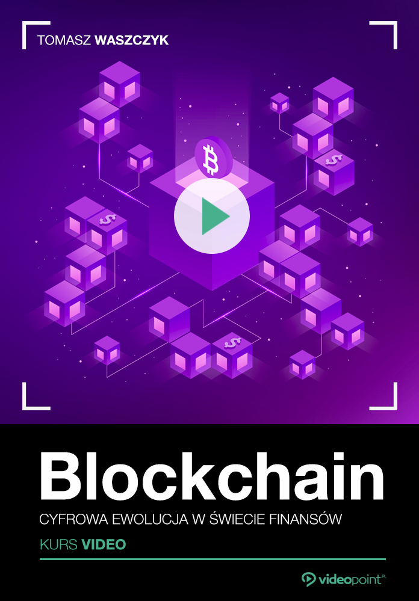

### Hi there 👋

## Obierz kurs na... cyfrowe aktywa

Blockchain od kilku lat elektryzuje świat finansów i powiązaną z nim część branży informatycznej. Zwany inaczej łańcuchem bloków, stanowi zdecentralizowaną bazę danych o architekturze peer-to-peer (czyli taką, w której wszystkie węzły mają te same uprawnienia). Blockchain nie potrzebuje komputerów centralnych ani głównego miejsca przechowywania danych - wszystko jest tu rozproszone, dzięki czemu bardzo bezpieczne i nie do zhakowania przez współczesne komputery. W kursie opowiadam o:

- 🔭 historii ruchu cypherpunk
- 🌱 technologi Substrate
- 👯 pokazuję jaki wpływ może wywrzeć na technologia
- 🤔 oraz wiele więcej..

💬 Będę wdzięczny za każdą wiadomość zwrotną.

